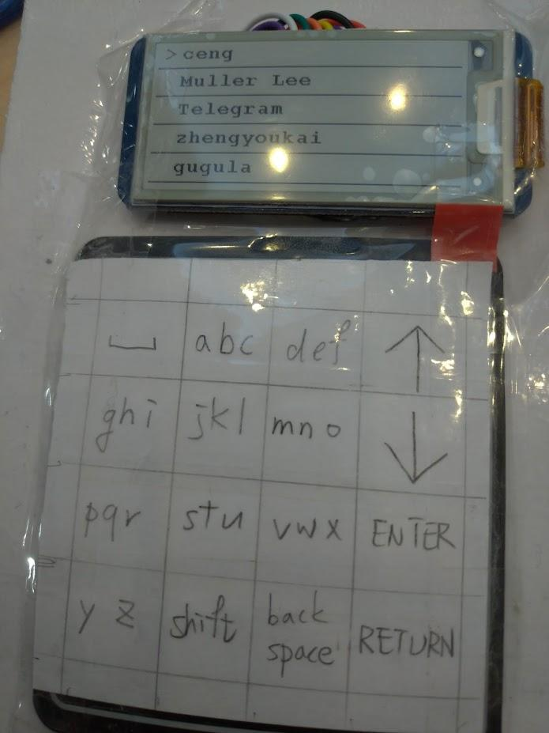
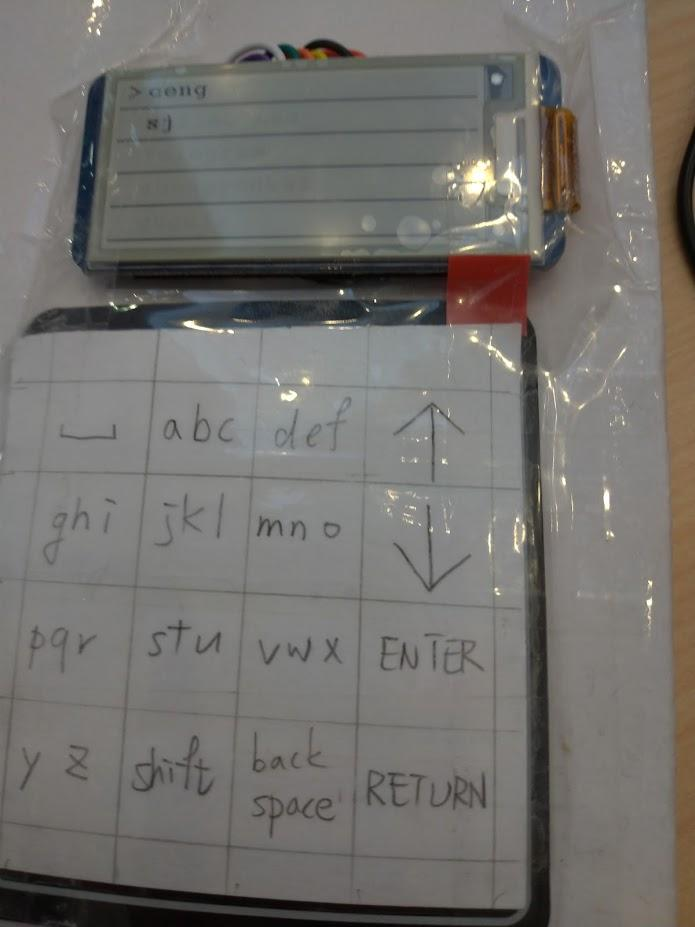

# Telegram Client
A Telegram client based on a STM32L476RG board, magic and trash

I don't know what happened but it works.

## Features
- Listing your friends and send/receive messages
- A tetris game(?

## Hardware components
- STM32L476RG board
- 4 x 4 Keypad
- [Waveshare 2.13inch e-Paper HAT](http://www.waveshare.net/wiki/2.13inch_e-Paper_HAT)

## Preview

